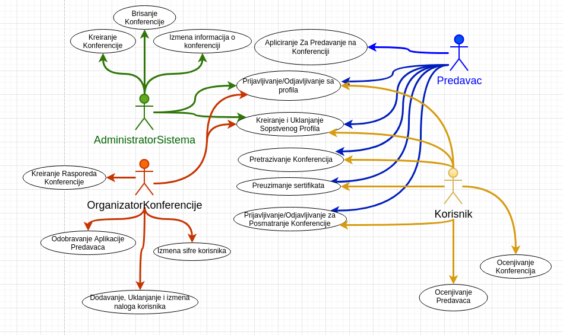

# Web-aplikacija-za-konferencije

Ovo je projekat gde se gradi web aplikacija za konferencije gde clanovi sajta mogu da se prijave kakok predavaci ili kao posmatraci na konferenciji.

Svaki clan ovog sajta je u mogucnosti da pretrazuje listu buducih i proslih konferencija kako bi imao/la priliku da prisustvuje istim ili da sazna nesto vise o konferencijama.

Plan projekta je sledeci:

Website ce biti programiran u JavaScript, HTML, CSS, dok ce za bazu podataka biti koriscen MySQL.

# Potrebas softver

1. [XAMP](https://www.apachefriends.org/download.html) treba biti instsaliran da bi mogli pokrenuti stranicu na nasem racunaru bez potrebe interneta.
2. U XAMP folderu gde ste ga sacuvali, kopirajte vase web fajlove u **htdocs** folder.
3. U "search bar" unesite http://localhost/ime_vaseg_fajla.html

Rezultat vase stranice ce se pojaviti u internet pretrazivacu. 

# Fajlovi i njihova svrha

- homePage.html - stranica na kojoj ce sve konferencije biti izlistane jedna ispod druge sa dodatnim informacijama. 
